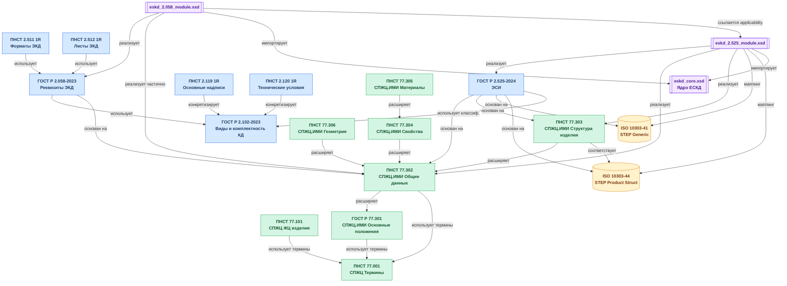

```mermaid
graph TD
    classDef eskd fill:#d4e9ff,stroke:#2563eb,color:#1e3a5f,font-weight:bold
    classDef spjc fill:#d4f5e4,stroke:#16a34a,color:#14532d,font-weight:bold
    classDef iso  fill:#fff3cd,stroke:#d97706,color:#78350f,font-weight:bold
    classDef xsd  fill:#f3e8ff,stroke:#7c3aed,color:#4c1d95,font-weight:bold

    G2058["ГОСТ Р 2.058-2023<br/>Реквизиты ЭКД"]
    G2102["ГОСТ Р 2.102-2023<br/>Виды и комплектность КД"]
    G2525["ГОСТ Р 2.525-2024<br/>ЭСИ"]
    G2119["ПНСТ 2.119 1R<br/>Основные надписи"]
    G2120["ПНСТ 2.120 1R<br/>Технические условия"]
    G2511["ПНСТ 2.511 1R<br/>Форматы ЭКД"]
    G2512["ПНСТ 2.512 1R<br/>Листы ЭКД"]
    G77001["ПНСТ 77.001<br/>СПЖЦ Термины"]
    G77101["ПНСТ 77.101<br/>СПЖЦ ЖЦ изделия"]
    G77301["ГОСТ Р 77.301<br/>СПЖЦ.ИМИ Основные положения"]
    G77302["ПНСТ 77.302<br/>СПЖЦ.ИМИ Общие данные"]
    G77303["ПНСТ 77.303<br/>СПЖЦ.ИМИ Структура изделия"]
    G77304["ПНСТ 77.304<br/>СПЖЦ.ИМИ Свойства"]
    G77305["ПНСТ 77.305<br/>СПЖЦ.ИМИ Материалы"]
    G77306["ПНСТ 77.306<br/>СПЖЦ.ИМИ Геометрия"]
    ISO41[("ISO 10303-41<br/>STEP Generic")]
    ISO44[("ISO 10303-44<br/>STEP Product Struct")]
    CORE[["eskd_core.xsd<br/>Ядро ЕСКД"]]
    XSD2525[["eskd_2.525_module.xsd"]]
    XSD2058[["eskd_2.058_module.xsd"]]

    G2525 -->|"основан на"| G77302
    G2525 -->|"основан на"| G77303
    G2525 -->|"основан на"| ISO41
    G2525 -->|"основан на"| ISO44
    G2525 -->|"использует классиф."| G2102
    G2058 -->|"использует"| G2102
    G2058 -->|"основан на"| G77302
    G2119 -->|"конкретизирует"| G2102
    G2120 -->|"конкретизирует"| G2102
    G2511 -->|"использует"| G2058
    G2512 -->|"использует"| G2058
    G77302 -->|"расширяет"| G77301
    G77302 -->|"использует термины"| G77001
    G77303 -->|"расширяет"| G77302
    G77303 -->|"соответствует"| ISO44
    G77304 -->|"расширяет"| G77302
    G77305 -->|"расширяет"| G77304
    G77306 -->|"расширяет"| G77302
    G77301 -->|"использует термины"| G77001
    G77101 -->|"использует термины"| G77001
    XSD2525 -->|"реализует"| G2525
    XSD2525 -->|"реализует"| G77302
    XSD2525 -->|"реализует"| G77303
    XSD2525 -->|"маппинг"| ISO41
    XSD2525 -->|"маппинг"| ISO44
    XSD2058 -->|"реализует"| G2058
    XSD2058 -->|"реализует частично"| G77302
    XSD2525 -->|"импортирует"| CORE
    XSD2058 -->|"импортирует"| CORE
    XSD2058 -->|"ссылается applicability"| XSD2525

    class G2058 eskd
    class G2102 eskd
    class G2525 eskd
    class G2119 eskd
    class G2120 eskd
    class G2511 eskd
    class G2512 eskd
    class G77001 spjc
    class G77101 spjc
    class G77301 spjc
    class G77302 spjc
    class G77303 spjc
    class G77304 spjc
    class G77305 spjc
    class G77306 spjc
    class ISO41 iso
    class ISO44 iso
    class CORE xsd
    class XSD2525 xsd
    class XSD2058 xsd
```
