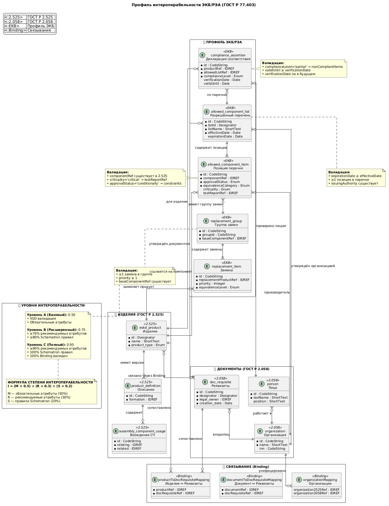

# Профиль интероперабельности ЭКБ/РЭА

## Назначение

Нормативный профиль для обмена перечнями разрешённых радиоэлектронной аппаратуры (РЭА) и электронной компонентной базы (ЭКБ) между информационными системами участников кооперации.

**Уровни интероперабельности:**
- **Семантический:** Единая модель данных перечней ЭКБ/РЭА
- **Технический:** Форматы XML + XSD 1.1

**Не входит в область применения:**
- Организационный уровень (регулируется отдельными соглашениями)
- Платформенные концепции (API, сервисы, реестры)
- Требования масштабируемости платформ

##  Диаграмма сушностей, атрибутов, связей
- Полная - [ссылка](docs/REA_interop-ER-full.png)
- Сокращенная:



---

## Сценарии использования 
### Сценарий 1: Верификация комплектации при разработке РЭА

 **Контекст:** Инженер-конструктор формирует спецификацию изделия в САПР, интегрированной с системой управления данными (УДИ/PLM). **Поток:** 1. Система генерирует `ComplianceAssertion` для изделия, ссылаясь на актуальный `AllowedComponentList`. 2. Автоматическая валидация через XSD + Schematron проверяет: - Наличие всех обязательных атрибутов компонентов - Соответствие статусов допуска (`approvalStatus ≠ prohibited`) - Целостность ссылок на нормативные документы 3. При уровне интероперабельности ≥B система формирует протокол соответствия для передачи в отдел нормоконтроля. **Выгода:** Снижение риска использования неразрешённых компонентов на этапе проектирования.

### Сценарий 2: Межорганизационный обмен перечнями при импортозамещении

 **Контекст:** Головной исполнитель и субподрядчик обмениваются данными о допустимых заменах иностранных компонентов на отечественные аналоги. **Поток:** 1. Головной исполнитель публикует `ReplacementGroup` с приоритизированными аналогами (`priority=1` для предпочтительных). 2. Субподрядчик импортирует профиль в свою УДИ, используя `eskd_binding.xsd` для маппинга ссылок. 3. Система автоматически проверяет: - Совместимость версий профилей (`profileVersion`) - Наличие расширенной информации в атрибутах уровня B (`manufacturer`, `qualificationStatus`) 4. При расхождении в степени интероперабельности генерируется отчёт о несоответствиях для согласования. **Выгода:** Стандартизированный обмен данными без потерь семантики при смене платформ.

### Сценарий 3: Аудит соответствия при сертификации изделия 

**Контекст:** Орган по сертификации проверяет документацию на соответствие требованиям по применению разрешённой ЭКБ. **Поток:** 1. Заявитель предоставляет пакет данных в формате профиля ЭКБ с уровнем интероперабельности C. 2. Валидатор проверяет: - Прохождение всех правил Schematron (включая бизнес-правила: `effectiveDate ≤ verificationDate`) - Полноту заполнения рекомендуемых атрибутов (`≥90%`) - Корректность маппинга между модулями 2.525 и 2.058 3. Формируется машиночитаемый протокол аудита с указанием степени интероперабельности и перечнем замечаний. **Выгода:** Автоматизация проверки, снижение субъективности аудита, ускорение сертификации. 

---

## Структура репозитория

```
interop-ver-0.2/
├── README.md                       # Этот файл
├── docs/                           # Документация
│   ├── profile_guide.md            # Руководство по применению профиля
│   ├── interoperability_levels.md  # Степени интероперабельности
│   ├── extension_rules.md          # Правила расширения профиля
│   ├── entity_sprav.md             # Справочная информация, сущности, связи
│   ├── REA_interop-ER-full.puml    # ER-диаграмма полная
│   └── REA_interop-ER-smpl.puml    # ER-диаграмма сокращенная для презентации
├── xsd/                            # XML Schema
│   ├── core/                       # Базовые типы
│   │   └── eskd_core.xsd
│   ├── modules/                    # Модули данных
│   │   ├── eskd_2.525_module.xsd
│   │   └── eskd_2.058_module.xsd
│   ├── binding/                    # Связывание модулей
│   │   └── eskd_binding.xsd
│   ├── profile/                    # Профили интероперабельности
│   │   ├── eskd_profile_interface.xsd
│   │   ├── eskd_profile_ekb.xsd
│   │   └── eskd_profile_nsi.xsd
│   └── eskd_profile_catalog.xml    # Каталог профилей
├── schematron/                     # Правила валидации
│   └── eskb-rerea-1.0.sch
├── examples/                       # Примеры данных
│   ├── ekb-rerea-1.0/
│   │   └── example_ekb_profile.xml
│   └── nsi-reference-1.0/
│       └── example_nsi_profile.xml
└── tests/                          # Тесты соответствия
    └── conformance_tests.md
```

---

## Быстрый старт

### 1. Основная документация
   * [Руководство по применению профиля](docs/profile_guide.md)
   * [Степени интероперабельности](docs/interoperability_levels.md)
   * [Правила расширения профиля](docs/extension_rules.md)

### 2. Примеры данных
   * [Пример профиля ЭКБ/РЭА](examples/ekb-rerea-1.0/example_ekb_profile.xml)
   * [Пример профиля НСИ](examples/nsi-reference-1.0/example_nsi_profile.xml)

### 3. Запуск валидации

```bash
# Валидация XSD (требуется процессор XSD 1.1)
xmllint --schema xsd/profile/eskd_profile_ekb.xsd \
  examples/ekb-rerea-1.0/example_ekb_profile.xml \
  --noout

# Валидация Schematron (требуется Saxon HE)
java -jar saxon-he.jar \
  -s:examples/ekb-rerea-1.0/example_ekb_profile.xml \
  -xsl:schematron/eskb-rerea-1.0.sch
```

### 4. Тесты соответствия

   * См. тесты в [tests/conformance_tests.md](tests/conformance_tests.md)

---

## Степени интероперабельности

| Уровень | Название | Минимальная степень | Статус обмена |
|---------|----------|---------------------|---------------|
| **A** | Базовый | 0.50 | Допустим для внутреннего обмена |
| **B** | Расширенный | 0.75 | Допустим для межорганизационного обмена |
| **C** | Полный | 0.95 | Рекомендуется для критичных данных |

**Формула расчёта:**
```
I = (M × 0.5) + (R × 0.3) + (S × 0.2)

Где:
  M — доля заполненных обязательных атрибутов
  R — доля заполненных рекомендуемых атрибутов
  S — доля пройденных правил Schematron
```

---

## Нормативные ссылки

| Обозначение | Наименование |
|-------------|--------------|
| ГОСТ Р 2.525-2024 | Электронная структура изделия конструктивная. Формат данных |
| ГОСТ Р 2.058-2023 | Реквизитная часть электронных конструкторских документов |
| ГОСТ Р 77.302-202X | Информационная модель изделия. Общие данные об изделии |
| ГОСТ Р 77.403-202X | Профили интероперабельности |
| ГОСТ 2.201-80 | Обозначение изделий и конструкторских документов |
| ГОСТ Р ИСО 10303-21 | Представление данных об изделии. Кодирование открытым текстом |
