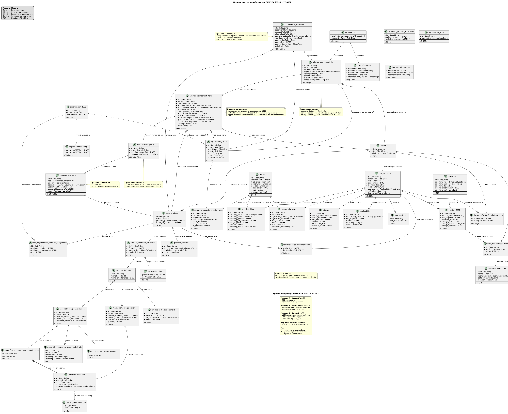

# Профиль интероперабельности ЭКБ/РЭА

## Назначение

Нормативный профиль для обмена перечнями разрешённых радиоэлектронной аппаратуры (РЭА) и электронной компонентной базы (ЭКБ) между информационными системами участников кооперации.

**Уровни интероперабельности:**
- **Семантический:** Единая модель данных перечней ЭКБ/РЭА
- **Технический:** Форматы XML + XSD 1.1

**Степени интероперабельности**

| Уровень | Название | Статус обмена |
|---------|----------|---------------|
| **A** | Базовый | Допустим для внутреннего обмена |
| **B** | Расширенный | Допустим для межорганизационного обмена |
| **C** | Полный | Рекомендуется для критичных данных |

**Не входит в область применения:**
- Организационный уровень (регулируется отдельными соглашениями)
- Платформенные концепции (API, сервисы, реестры)
- Требования масштабируемости платформ

---

## Сценарии использования 

* [Валидация спецификаций и нормоконтроль на этапах проектирования и кооперации](docs/REA_interop-cases.md#1-валидация-спецификаций-и-нормоконтроль-на-этапах-проектирования-и-кооперации)
* [Управление заменами и импортозамещением в кооперационной цепочке](docs/REA_interop-cases.md#2-управление-заменами-и-импортозамещением-в-кооперационной-цепочке)
* [Интеграция с государственными и отраслевыми реестрами](docs/REA_interop-cases.md#3-интеграция-с-государственными-и-отраслевыми-реестрами)
* [Формализованный приёмочный контроль опытных образцов](docs/REA_interop-cases.md#4-формализованный-приёмочный-контроль-опытных-образцов)
* [Миграция и синхронизация данных при замене PLM/ERP-платформ](docs/REA_interop-cases.md#5-миграция-и-синхронизация-данных-при-замене-plmerp-платформ)
* [Аудит соответствия при сертификации изделия](docs/REA_interop-cases.md#6-аудит-соответствия-при-сертификации-изделия)

---
##  Диаграмма сушностей, атрибутов, связей
| Сокращенная | Полная |
|---------|----------|
|  |  |

## Структура репозитория

```
interop-ver-0.2/
├── README.md                       # Этот файл
├── docs/                           # Документация
│   ├── profile_guide.md            # Руководство по применению профиля
│   ├── interoperability_levels.md  # Степени интероперабельности
│   ├── extension_rules.md          # Правила расширения профиля
│   ├── entity_sprav.md             # Справочная информация, сущности, связи
│   ├── REA_interop-ER-full.puml    # ER-диаграмма полная
│   └── REA_interop-ER-smpl.puml    # ER-диаграмма сокращенная для презентации
├── xsd/                            # XML Schema
│   ├── core/                       # Базовые типы
│   │   └── eskd_core.xsd
│   ├── modules/                    # Модули данных
│   │   ├── eskd_2.525_module.xsd
│   │   └── eskd_2.058_module.xsd
│   ├── binding/                    # Связывание модулей
│   │   └── eskd_binding.xsd
│   ├── profile/                    # Профили интероперабельности
│   │   ├── eskd_profile_interface.xsd
│   │   ├── eskd_profile_ekb.xsd
│   │   └── eskd_profile_nsi.xsd
│   └── eskd_profile_catalog.xml    # Каталог профилей
├── schematron/                     # Правила валидации
│   └── eskb-rerea-1.0.sch
├── examples/                       # Примеры данных
│   ├── ekb-rerea-1.0/
│   │   └── example_ekb_profile.xml
│   └── nsi-reference-1.0/
│       └── example_nsi_profile.xml
└── tests/                          # Тесты соответствия
    └── conformance_tests.md
```

---

## Быстрый старт

### 1. Основная документация
   * [Руководство по применению профиля](docs/profile_guide.md)
   * [Степени интероперабельности](docs/interoperability_levels.md)
   * [Правила расширения профиля](docs/extension_rules.md)

### 2. Примеры данных
   * [Пример профиля ЭКБ/РЭА](examples/ekb-rerea-1.0/example_ekb_profile.xml)
   * [Пример профиля НСИ](examples/nsi-reference-1.0/example_nsi_profile.xml)

### 3. Запуск валидации

```bash
# Валидация XSD (требуется процессор XSD 1.1)
xmllint --schema xsd/profile/eskd_profile_ekb.xsd \
  examples/ekb-rerea-1.0/example_ekb_profile.xml \
  --noout

# Валидация Schematron (требуется Saxon HE)
java -jar saxon-he.jar \
  -s:examples/ekb-rerea-1.0/example_ekb_profile.xml \
  -xsl:schematron/eskb-rerea-1.0.sch
```

### 4. Тесты соответствия

   * См. тесты в [tests/conformance_tests.md](tests/conformance_tests.md)

---

## Формула интероперабельности
Детализация и формула определения

| Уровень | Название | Минимальная степень | Статус обмена |
|---------|----------|---------------------|---------------|
| **A** | Базовый | 0.50 | Допустим для внутреннего обмена |
| **B** | Расширенный | 0.75 | Допустим для межорганизационного обмена |
| **C** | Полный | 0.95 | Рекомендуется для критичных данных |

**Формула расчёта:**
```
I = (M × 0.5) + (R × 0.3) + (S × 0.2)

Где:
  M — доля заполненных обязательных атрибутов
  R — доля заполненных рекомендуемых атрибутов
  S — доля пройденных правил Schematron
```

---

## Нормативные ссылки

| Обозначение | Наименование | Область применения в профиле |
|-------------|--------------|------------------------------|
| ГОСТ Р 2.525-2024 | Электронная структура изделия конструктивная. Формат данных | Моделирование состава изделия |
| ГОСТ Р 2.058-2023 | Реквизитная часть электронных конструкторских документов | Идентификация лиц и организаций |
| ГОСТ Р 77.302-202X | Информационная модель изделия. Общие данные об изделии | Базовая информационная модель |
| ГОСТ Р 77.403-202X | Профили интероперабельности | Архитектура профиля |
| ГОСТ 2.201-80 | Обозначение изделий и конструкторских документов | Правила обозначения |
| **ГОСТ 2.102-2023** | **Виды и комплектность конструкторских документов** | **Классификация документов (СП, ЭСК, ВП, ВР)** |
| **ГОСТ 2.111-2013** | **Нормоконтроль** | **Отчёты о проверке соответствия** |
| **ГОСТ 2.124-2014** | **Порядок применения покупных изделий** | **Согласование перечней, импортные компоненты** |
| **ГОСТ 2.053-2023** | **Электронная структура изделия. Общие требования** | **Поэлементная проверка соответствия** |
| ГОСТ Р ИСО 10303-21 | Представление данных об изделии. Кодирование открытым текстом | Альтернативный формат обмена |

---

## Новые модули расширения (версия 2.x)

### Модуль согласования и импортных данных (`eskd_2.124_module.xsd`)
**Назначение:** Поддержка процессов согласования перечней и учёт импортных компонентов.

**Ключевые типы:**
- `ApprovalRouteType` — маршрут согласования позиции (этапы, даты, ответственные лица).
- `ImportedComponentDataType` — данные о сертификатах и разрешениях на импортные компоненты.

**Соответствие:** ГОСТ 2.124-2014 (пункты 4.2, 5.1).

### Модуль проверки соответствия (`eskd_compliance_check.xsd`)
**Назначение:** Автоматизированная поэлементная проверка состава изделия на соответствие разрешённому перечню.

**Ключевые типы:**
- `ComplianceCheckType` — результат проверки отдельного компонента (`passed`, `failed`, `warning`).
- `ComplianceReportType` — отчёт о проверке всего изделия с детализацией по компонентам.

**Соответствие:** ГОСТ 2.053-2023 (пункт 7.2.1), ГОСТ 2.111-2013 (пункт 6.3).

### Модуль классификации документов (`eskd_document_classification.xsd`)
**Назначение:** Классификация конструкторских документов и связь перечней с ведомостями.

**Ключевые типы:**
- `DocumentKindCodeEnum` — коды видов документов (`СП`, `ЭСК`, `ВП`, `ВР`, `ПЭ3`, `ТУ` и др.).
- `StructureDocumentType` — абстрактный тип для спецификаций и электронных структур.

**Соответствие:** ГОСТ 2.102-2023 (таблица 1), ГОСТ 2.053-2023 (пункт 5.1).

### Подключение модулей
Модули являются самостоятельными и могут использоваться как отдельно, так и в составе основного профиля. Для подключения добавьте `xs:import` в основную схему:

```xml
<xs:import namespace="http://gost.ru/eskd/2.124/2024"
           schemaLocation="modules/eskd_2.124_module.xsd"/>
<xs:import namespace="http://gost.ru/eskd/compliance/2024"
           schemaLocation="modules/eskd_compliance_check.xsd"/>
<xs:import namespace="http://gost.ru/eskd/docclass/2024"
           schemaLocation="modules/eskd_document_classification.xsd"/>
```

Подробная документация: [docs/profile_guide.md](docs/profile_guide.md#приложения-d-e-f).
